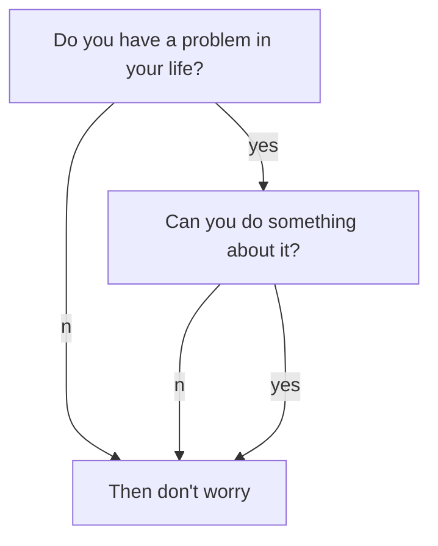
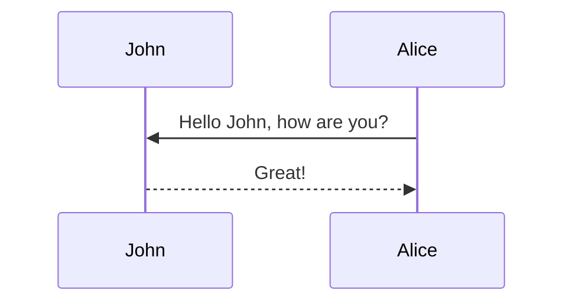
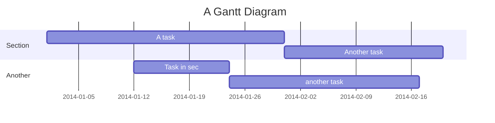

If you see this page, that means you have setup your site. enjoy! :ghost: :ghost: :ghost:

$$ \lim\limits_{x \rightarrow 0} x $$

You may want to [config the site](https://tianqi.name/jekyll-TeXt-theme/docs/en/configuration) or [writing a post](https://tianqi.name/jekyll-TeXt-theme/docs/en/writing-posts) next. Please feel free to [create an issue](https://github.com/kitian616/jekyll-TeXt-theme/issues) or [send me email](mailto:kitian616@outlook.com) if you have any questions.

https://mermaidjs.github.io/flowchart.html

https://mermaidjs.github.io/sequenceDiagram.html

https://mermaidjs.github.io/gantt.html

<!--more-->

---

If you like TeXt, don't forget to give me a star. :star2:

